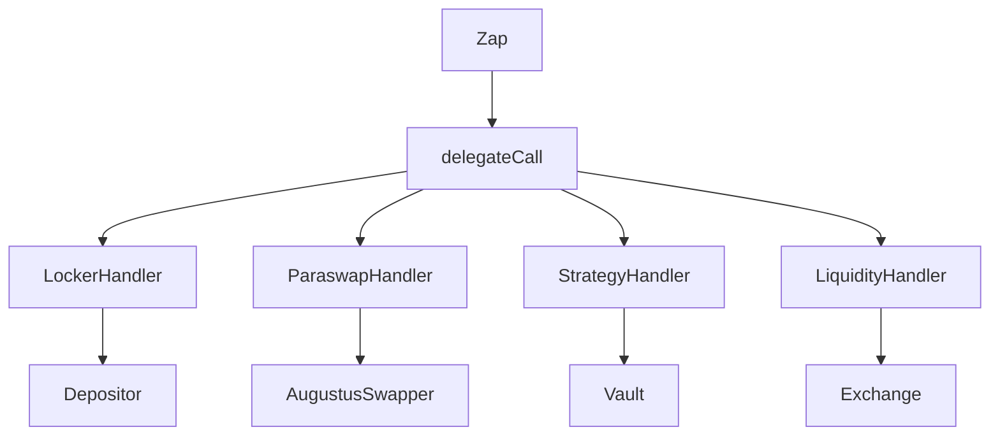

# <h1 align="center"> 💦 Lockers Room</h1>

    

 Swap any assets and get access to the lockers room.

# How it works ?

In order to enter the Locker rooms, Zap uses delegate call to `Handlers` contracts.
Using Zap, you can multiple combinations of actions such as :
- Deposit into Locker
- Deposit into Strategies
- Swap trough Paraswap and Deposit into Locker
- Swap trough Paraswap, add liquidity and deposit into Strategies.

and many more etc.

# WIP
`LiquidityHandler.sol`